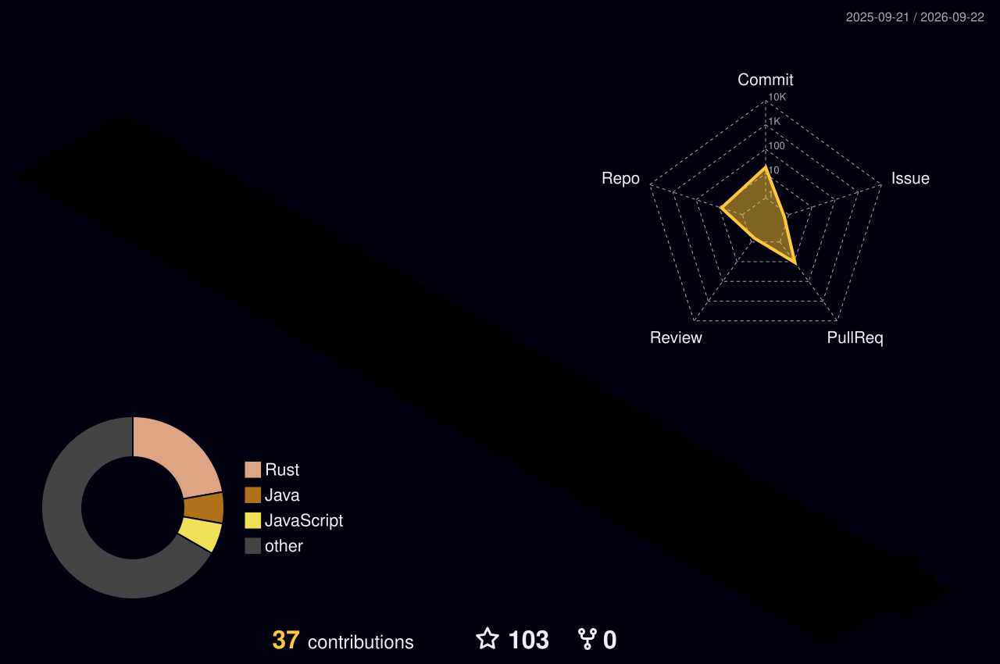

# 你好，我是 ordinary-s

### Java 后端 × AI Agent 工程师

以 Java 和 Spring Boot 为基础，探索可靠的 AI Agent 系统与大模型应用工程。

**Agent Runtime · Tool Calling · MCP · 状态恢复 · 分布式系统**

## 关于我

我关注 AI Agent 背后的后端工程：会话状态能否正确恢复，多个服务副本之间如何协调执行，工具调用和协议交互在异常情况下会怎样处理。

目前的开源贡献主要围绕 Agent 状态恢复、跨副本执行协调、子 Agent 的工具边界，以及 MCP 协议交互展开。我习惯从可复现的问题入手，定位根因、明确改动范围，再用回归测试验证行为。下面的 PR 记录了这些工作的实现过程与验证结果。

## 工程方向

| 方向 | 关注内容 |
| --- | --- |
| Java 后端 | Java、Spring Boot、Spring MVC / WebFlux、分布式系统 |
| Agent 运行时 | Agent State Recovery、状态持久化、异常传播、子 Agent 与 Hooks |
| 工具与协议 | MCP、Tool Calling、工具过滤、执行与安全边界 |
| 数据与检索 | PostgreSQL、Redis、Elasticsearch、Milvus、RAG 与检索流程 |

## 当前关注

- **Agent 执行可靠性：** 状态恢复、Agent Resume、执行权的原子抢占与分布式协调。
- **大模型应用基础设施：** MCP 集成、工具生命周期、RAG、混合检索（Hybrid Retrieval）与重排序（Reranker）评估。

## 技术栈

<picture>
  <source media="(prefers-color-scheme: dark)" srcset="https://skillicons.dev/icons?i=java%2Cspring%2Cpython%2Cpostgres%2Credis%2Celasticsearch%2Cdocker%2Ckubernetes%2Cgit%2Cgithub%2Clinux%2Cmaven%2Cgradle&amp;perline=7&amp;theme=dark" />
  <source media="(prefers-color-scheme: light)" srcset="https://skillicons.dev/icons?i=java%2Cspring%2Cpython%2Cpostgres%2Credis%2Celasticsearch%2Cdocker%2Ckubernetes%2Cgit%2Cgithub%2Clinux%2Cmaven%2Cgradle&amp;perline=7&amp;theme=light" />
  
</picture>

**AI 工程：** LLM · RAG · AI Agent · MCP · Tool Calling · Agent Runtime · State Recovery · Hybrid Retrieval · Reranker

## 代表性开源贡献

以下展示 **6 个已合并 PR** 与 **3 个审查中 PR**，作者与状态已于 **2026-09-06** 核实。点击链接可查看上游讨论、代码改动与最新状态。

### ✅ 已合并（Merged）

**[AgentScope Java #2760 — 向上抛出 Agent 状态加载异常](https://github.com/agentscope-ai/agentscope-java/pull/2760)** 
Agent Runtime · Agent State Recovery · 状态持久化

修复状态加载或解码失败后静默创建空 `AgentState` 的问题，让原始异常传递给调用方，避免将恢复失败误判为新会话，进而覆盖有效的持久化会话状态。补充了加载失败、状态不存在、已有状态恢复，以及缓存与持久化数据完整性的回归测试。

**[DBX #8249 — 为 Redis 键浏览与值搜索限制隐式扫描](https://github.com/t8y2/dbx/pull/8249)** 
Redis · 扫描预算 · 游标分页 · 异步状态隔离

修复值搜索自动遍历到游标归零、主键自动加载额外推进子树等问题，让初始值搜索只读取一页，并由用户操作继续加载。保留自动键扫描预算，防止旧异步回调干扰新操作。114 项定向测试通过，并使用真实 Redis 完成百万键场景的扫描与分页验证。

**[DBX #7315 — 降低 HTTP 隧道的往返延迟](https://github.com/t8y2/dbx/pull/7315)** 
根因分析 · 网络 / I/O 延迟 · 自适应轮询

定位到 PHP worker 等待时只监听数据库 socket，文件队列的新写入无法将其唤醒，导致连续协议交互累积延迟。引入有界自适应轮询，并补充数据转发、轮询状态切换和进程关闭的回归测试。

| 基准测试：100 次顺序往返 | 优化前 | 优化后 |
| --- | ---: | ---: |
| 总耗时 | 20.100 s | 1.073 s |

**该基准下速度约为原来的 18.7 倍（18.7×）。** 测试在 PHP 7.4/Linux 上使用真实 PHP worker、文件队列和本地确定性 TCP echo 目标完成；结果仅对应这一测试场景，不代表通用数据库性能提升。

**其他已合并贡献**

| PR | 工程贡献 |
| --- | --- |
| [DBX #6601 — MCP 启动兼容](https://github.com/t8y2/dbx/pull/6601) | 修复 `PNPM_HOME` 与所选 Node 运行时分离时，无法发现 MCP 服务的问题；解析 PATH 中的 pnpm 启动脚本，启动前校验包身份和 Node 兼容性，并补充布局分离场景的回归测试。 |
| [DBX #7181 — Kingbase schema 解析](https://github.com/t8y2/dbx/pull/7181) | 按 `search_path` 解析未限定表名的真实 schema，并贯通元数据与查询结果编辑流程，修复将数据库名误作 schema 导致更新、删除报错的问题；通过真实 KingbaseES 端到端验证。 |
| [codex-watchdog #1 — 配额恢复后续跑任务](https://github.com/flowing-water1/codex-watchdog/pull/1) | 增加配额解析与等待逻辑，结合事件通知和定时轮询，在配额重置后重新核实目标状态再恢复执行；排除手动暂停、预算限制与已完成目标，91 项测试通过。 |

### 🔍 审查中（In Review）

以下 PR 当前仍为 Open，尚未合并。

**[AgentScope Java #2890 — 在多个副本间共享恢复执行的协调状态](https://github.com/agentscope-ai/agentscope-java/pull/2890)** 
多副本 · Redis · Lua · 执行权原子抢占 · Agent Resume

提出共享的恢复执行状态存储，通过 Redis Lua 脚本原子地处理执行权和状态转换，并接入 Spring MVC / WebFlux。测试覆盖跨副本协调与并发抢占。进程硬崩溃后可能遗留执行权占用，这是 PR 已记录的限制；租约续期和 fencing 机制仍需后续完善。

**[AgentScope Java #2996 — 让声明式子 Agent 继承父 Agent 的 Hooks](https://github.com/agentscope-ai/agentscope-java/pull/2996)** 
Subagent · Hooks · Tool Calling · Agent Harness · 安全边界

提出让声明式子 Agent 继承父 Agent 显式配置的 Hooks，同时对 Hooks 注入的工具应用声明允许列表与工作区工具过滤规则。回归测试覆盖子 Agent 的工具执行、参数拦截、受限工具的拒绝执行，以及 Hook 顺序。

**[MCP Java SDK #1098 — 修复有状态客户端的 roots/list_changed 通知处理](https://github.com/modelcontextprotocol/java-sdk/pull/1098)** 
Java · MCP · Stateful Client · 通知处理 · 协议运行时

提出在未注册 roots 变更消费者时跳过不必要的 roots 列举请求，避免 `roots/list_changed` 通知处理一直阻塞到请求超时，并补充集成回归测试。

## GitHub 数据

<picture>
  <source media="(prefers-color-scheme: dark)" srcset="./profile/stats-dark.svg" />
  <source media="(prefers-color-scheme: light)" srcset="./profile/stats.svg" />
  
</picture>
<picture>
  <source media="(prefers-color-scheme: dark)" srcset="./profile/top-langs-dark.svg" />
  <source media="(prefers-color-scheme: light)" srcset="./profile/top-langs.svg" />
  
</picture>

公开活动卡片由 [GitHub Readme Stats Action](https://github.com/stats-organization/github-readme-stats-action) 每日生成。语言卡只统计非 Fork 公开仓库，目前暂无语言数据；参与上游项目的工程工作见上方 PR。

## 3D 贡献图

<picture>
  <source media="(prefers-color-scheme: dark)" srcset="./profile-3d-contrib/profile-night-rainbow.svg" />
  <source media="(prefers-color-scheme: light)" srcset="./profile-3d-contrib/profile-green.svg" />
  
</picture>

## 贡献贪吃蛇

<picture>
  <source media="(prefers-color-scheme: dark)" srcset="https://raw.githubusercontent.com/ordinary-s/ordinary-s/output/github-snake-dark.svg" />
  <source media="(prefers-color-scheme: light)" srcset="https://raw.githubusercontent.com/ordinary-s/ordinary-s/output/github-snake.svg" />
  
</picture>
